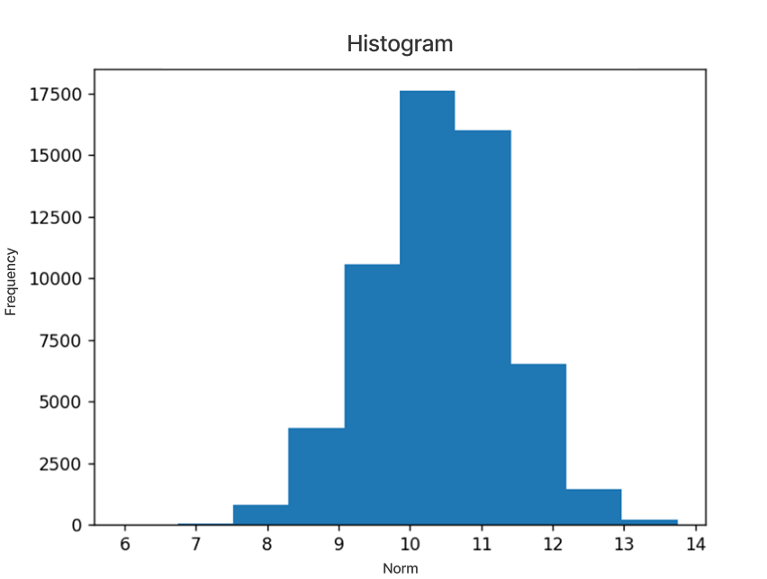
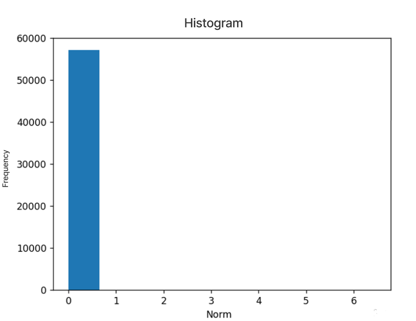
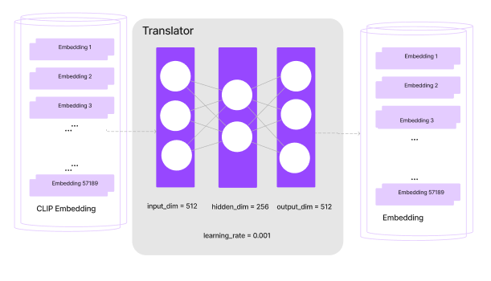

# Audio-to-image
Este repositorio va a mostrar un modelo que utiliza AudioLDM para sonorizar imagenes. Para ello, se ha utilizado el modelo AudioLDM preentrenado para poder generar audios cuando recibe como entrada una imagen. Se han seguido distintos paso para llegar a dicha implementación. AudioLDM es un modelo que es capaz de generar audio a partir de un texto, para poder realizar el proceso cuenta en su implementación con el modelo CLAP. La función principal de CLAP es la de condicionar los audios generados en función de un texto a la entrada o lo que es lo mismo, los embeddings que salen del módulo CLAP son vectores que condicionan la generación de audio por el texto. AudioLDM utiliza el codificador de CLAP para codificicar sus textos. Este hecho se va a aprovechar para desarrollar una red neuronal Traductor que sea capaz de traducir los embeddings de CLIP en embeddings que se parezcan a embeddings de CLAP, controlando este proceso con la ayuda de una función de coste. Se busca traducir los embeddings de CLIP en embeddings de CLAP, los embeddings de las imágenes que codifica CLIP están condicionados por textos y los embeddings de los textos por las imágenes. Como el objetivo de este modelo es generar audio a partir de una imagen resulta conveniente usar CLIP para este proceso. CLIP es modelo multimodal creado por la empresa OpenAI que utiliza el aprendizaje zero shot y utiliza NLP para supervisar el entrenamiento, es decir, es capaz de trabajar con un dato que no ha visto antes solo conociendo su descripción o nombre. CLIP está formado por una red neuronal que ha sido entrenado por una variedad de pares(imagen, texto). Busca que dada una imagen es capaz de encontrar el mejor texto para esa imagen. Una vez que se tenga el modelo Traductor creado, se sustituirá el encoder de texto de AudioLDM por este modelo para conseguir que AudioLDM sea capaz de generar sonido dada una imagen.

<div align="center">
  
</div>

En este repositorio se van a explicar los pasos seguidos para desarrollar este proceso.

## Fase I. Bases de datos

El primer paso es sacar los embeddings de las distintas bases de datos que se han utlizado para el entrenamiento de los modelos translate. Primero de todo, se comienza a sacar los embeddings de la base de datos que utilizó AudioLDM para su entrenamiento, esta fue Audiocaps. Audiocaps es una base de datos que se encarga de describir en lenguaje natural cualquier tipo de audio en condiciones reales. Esta base de datos consta de 57000 pares de clips de audios y descripciones de texto escrito por humanos.

La columna que es importante para la implementación de la red neuronal es la de captions, ya que en ella se encuentran las descripciones de los sonidos. Una vez descargada toda la base de datos se procede a obtener los embeddings de la columna captions tanto por el codificador de CLIP como por el codificador de CLAP, ya que lo que se busca es desarrollar un modelo que sea capaz de traducir unos embeddings en otros.

Se realiza el proceso de codificación de cada una de las captions por medio del codificador de texto de CLIP y de CLAP. Se genera un archivo de texto en el que se recogen los embeddings de CLIP y de CLAP para una misma descripción de textos. Estos embeddings son vectores de 1x512. Es importante conocer si los valores se encuentran normalizados o no, por ello, se sacan los histogramas de las normas de ambos embeddings.

En la siguiente imagen se puede observar como los histogramas de CLIP no se encuentran normalizados, este es un dato muy importante porque a la hora de diseñar la red neuronal a de tenerse en cuenta, ya que la entrada del módulo deberá normalizar los valores antes de trabajar con ellos.

<div align="center">
  
</div>

Por otro lado, para los embeddings de CLAP, observables en la siguiente imagen, sus normas sí que están normalizadas entre 0 y 1, es decir, en este caso no es necesario que a la salida de la red neuronal se haga un proceso de desnormalización.

<div align="center">
  
</div>

Para poder reproducir el proceso de sacar los embeddings de las base de datos de Audiocaps, es necesario descargarla de la siguiente enlace https://audiocaps.github.io/ y sacar los siguientes pasos:


1. Clone the repository and navigate to where the code is:
   ```console
      git clone https://github.com/Laurafdez/Audio-to-image-with--AudioLDM.git
      ```
2. Navigate to where the code is:
   ```console
     cd /Audio-to-image-with--AudioLDM.git/TFM/Prior steps/audiocaps
      ```
       
2. En los siguientes scripts solo hay que cambiar el csv con el nombre de la base de datos Audiocaps y ejecutar
   ```console
     python embedding_CLIP.py
     ```
3. Y para sacar los embeddings de CLAP:
   ```console
     python embedding_CLAP.py
     ```
4. Se habrán creado dos csv con los embeddings de CLIP y CLAP, para crear archivos de textos con esa información de ejecuta el siguiente script:
   ```console
     python csvtotxt.py
     ```
5.  En este punto ya se tendrán todos los embeddings tanto de CLIP como los correspondientes de CLAP en archivos de texto para cada una de los datos de Adiocaps.


Con estos datos se entrenaran 6 modelos de Translate con distintas funciones de coste y de capa intermedia: 256 o 512. Y las funciones de coste son: distancia coseno, error cuadrático medio y constractive learning.

Adicionalmente, como se busca generar audios lo más fieles posible a las imágenes se decide entrenar 12 modelos más, la diferencia de estos modelos es que se van a entrenar 6 modelos primeros cuya base de datos sea la misma que ha utilizado CLIP en su entrenamiento. De esta manera los nuevos modelos Translator van a trabajar con los embeddings directamente de las imágenes y los traducirán en embeddings parecidos a los embeddings de CLAP. 

Para poder llevar a cabo este proceso se han descargado dos nuevas bases de datos. Por un lado, la base de datos que utiliza CLIP para entrenar, WIT:conjunto de datos de texto de imagen basado en Wikipedia. WIT son datos de texto de imagen basado en Wikipedia, es un conjunto multilingüe multimodal que se compone por 37,6 millones de ejemplos de textos con 11,5 millones de imágenes únicas en 108 idiomas. Este conjunto de datos se creó extrayendo múltiples textos asociados con una imagen de los artículos de Wikipedia y los enlaces de las imágenes de Wikimedia. Es el conjunto de datos más grande que existe hasta la fecha. Se utiliza sobre todo para el preentrenamiento de los modelos multimodales y presenta una alta calidad de alineación entre las imágenes y los textos. 

Se implementa un script que se encarga de descargar cada una de esas imágenes y sacar los embeddings correspondientes mediante el codificador de CLIP. Asimismo, se codifican las descripciones correspondientes de esas imágenes y con la ayuda del codificador de CLAP. Cada uno de estos embeddings tantos los de CLIP como los de CLAP se guardan en archivos txt. Para complmentar los datos descargados, se decide complementar la base de datos con nuevos valores utilizando una nueva base de datos Conceptual Captions. Conceptual Captions es una base de datos de imágenes de más de 3 millones de imágenes, junto con subtítulos en lenguaje natural. Estas imágenes y descripciones se recopilan de la Web y representan una variedad muy ampliada de estilos.


Para sacar los embeddings de la base de datos se deben descargar ambas bases de datos: https://github.com/google-research-datasets/wit y https://ai.google.com/research/ConceptualCaptions/ y se siguen los siguientes pasos:


1. Navigate to where the code is:
   ```console
     cd /Audio-to-image-with--AudioLDM.git/TFM/Prior steps/WIT
      ```
       
2. En los siguientes scripts solo hay que cambiar el csv con el nombre de la base de datos WIT o Conceptual Captions:
   ```console
     python embedding.py
     ```
3. En este punto se tienen los embeddings de CLIP y CLAP correspondientes en archivos de texto listos para entrenar los modelos translate.

## Translate

Una vez construida las base de datos de imagenes y de textos que describen los sonidos, se procede a entrenenar los modelos, en total se contruyen 18 modelos para las distintas bases de datos, dentro de la carpeta TFM se encuentran los archivos Models Audiocaps, models WIT y models con Audiocaps y WIT, con los scripts para implentar los distintos modelos con las distintas bases de datos. De cada tipo se entrenar 6 modelos el único dato que hay que cambiar es la dimensión de la capa oculta de 256 a 512. La forma de la red neuronal es la siguiente:

<div align="center">
  
</div>


Se entrenan cada uno de los modelos tomara un rato un ejemplo de como se debe hacer para uno de los modelos:

1. Navigate to where the code is:
   ```console
     cd /Audio-to-image-with--AudioLDM.git/TFM/Models_Audiocaps
      ```
       
2. Se entrena la base de datos para el modelo cuya base de datos es Audiocaps, su dimensión de la capa oculta de valor 256 y su función de coste es el error cuadrático medio:
   ```console
     python traductorEMC.py
     ```
3. Para entrenar el modelo con una capa de dimensión de calor 512 solo hay que cambiar ese dato en el codigo.
4. Se hace lo mismo para entrenar el modelo cuya función de coste es la distancia coseno:

5. Y se volverá a ejecutar el script anterior cmabiando el dato de la capa oculta a 512
6. Lo mismos dos pasos anteriores para entrenar el modelo cuya función de coste es Constractive Learning y se ejecuta:
   ```console
     python traductorEMC.py
     ```
7.  En este punto se obtienen 6 modelos entrenados con la base de datos de Audiocaps para entrenar el resto de modelos con las distintas bases de datos hay que seguir todos los pasos anteriores pero entrando y ejecutando los scripts que se encuentran dentro de Models_WIT+Audiocaps y Models_WIT. Ejecutando cada uno de los archivos y cambiando en cada uno de ellos la capa de dimension oculta de 256 a 512 se obtienen en total 12 modelos más.

## Implementación dentro de AudioLDM

Una vez, obtenido los modelos entrenados, se procede a introducir la arquitectura creada dentro del modelo AudioLDM. Primero de todo se descargó el código que se encuentra subido en el repositorio de AudioLDM https://github.com/haoheliu/AudioLDM, al que se le hizo todas las modificaciones para que pudiera recibir una imagen como entrada. Como se buscaba que el modelo fuera capaz de funcionar cuando recibiera una entrada de texto o una entrada de imagen. Para poder hacer este proceso se implementan los métodos siguiendo la misma metodología para cuando recibe un texto o una imagen. Ahora se le permite a la función que reciba la url de la imagen para que el modelo la descargue de Internet y lleve a cabo el proceso de generación de audio.

Una vez que se permite que el código pueda recibir un enlace con la foto en vez de la descripción de la imagen, se adapta al código para que pueda trabajar con ese caso. Se procede a hacer todos los cambios pertinentes para que la nueva implementación se pueda llevar a cabo. El cambio más importante se da cuando el código llama al módulo CLAP para realizar la codificación del texto ahora en vez de llamar a ese módulo se llama a una nueva clase implementada.

En esa nueva clase implementada es donde va el flujo cuando el código sacaba el embedding del texto, ahora irá a esta clase donde el modelo translate hará el proceso de traducción. Primero, se descargará la imagen del url proporcionado, después se sacará el embedding usando el modelo CLIP. El siguiente paso es sacar los embeddings parecidos a CLAP por medio del modelo translate. Una vez, obtenidos esos embeddings se devuelve al flujo ese vector y AudioLDM continua con su proceso hasta generar audio con ese nuevo embedding. Finalmente, se consigue generar audio a través de una imagen como entrada realizando estos cambios. Que el valor de los errores sea tan pequeño tiene sentido dado que al estar normalizados, al elevarlos al cuadrado los números van a ser cada vez más pequeños.

Para llevar a cabo este proceso:

1. Navigate to where the code is:
   ```console
     cd /Audio-to-image-with--AudioLDM.git/AudioLDMv1/audioldm
      ``` 
2. Para poder generar audio con alguno de los modelos entrenados es necesario ir al archivoo image_to_audio y escribir el nombre del modelo que se busca generar audio y escribir el tamaño de las capas del modelo.

3. Una vez realizada esta modificación se ejecuta el script:
   ```console
     python audioldm -t [URL imagen]
      ``` 
4. Pasados unos minutos en la carpte output se encontrará creado el audio para esa imagen.


